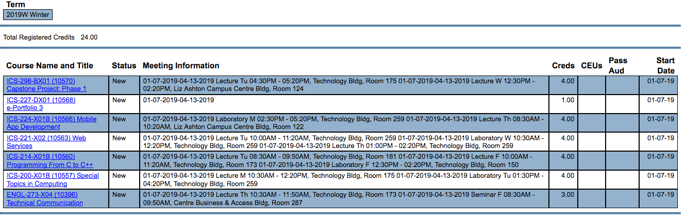

Scraping a dynamic website from behind a login page can be accomplished using Selenium with the Webdriver API, and pulling out the needed data with Python's Beautiful Soup library. In this post I'll show you how I did just that on my school's registration page, so I could start to build a better timetable for myself and my classmates.

## The problem

Getting information about the courses we are registered in as Camosun students, and the corresponding timetables for the current or upcoming semesters, has been notoriously difficult on the college's current web interface. Here is an example screenshot of how the course information is currently displayed on Camlink (the college's registration system):



Not very readable... But how to get the important information from this dynamic site, which is rendered largely with PHP and JavaScript, and export it to a separate file to generate a readable timetable? Beautiful Soup is a powerful library that works well on static pages for extracting data, but to generate such a static page we first need to navigate the site with an automated browser such as Selenium's WebDriver. Keep in mind, however, that one needs to [ensure the robots.txt file on the webpage you are visiting allows automated browsing](http://www.robotstxt.org/robotstxt.html)! Luckily, our college's website has no robots.txt file.

## Environment setup

The first step was to import the needed libraries into my scraper program, after doing the neccessary installations. These included, of course, Selenium's WebDriver and Beautiful Soup (I also ended up importing `Select` separately, for selecting from dropdown menus).

Because this is a CLI program and I didn't want to expose the user's password when they log in to the school's website, I used Python's `getpass` module. I also needed the `csv` and `json` libraries for exporting to different file formats, the `sys` module for the argv variables, and the `re` module for my regular expressions.

```python
from selenium import webdriver
from selenium.webdriver.support.ui import Select
from bs4 import BeautifulSoup
import getpass
import sys
import csv
import json
import re
```

## Receiving user input and starting the automated browser

The next step was to check for the verbose flag from the command line, which I find useful for debugging and to avoid constantly switching between commented and uncommented print statements. I then receive the user input on the command line, and start the driver.

Being a tool that is normally used for testing applications, WebDriver makes direct calls to the browser using each browser's native support for automation. In this program I call the Chrome browser, as it seems to have the best integration with Selenium, but I could have just as easily called the Firefox or Opera browers' webdriver functions. More information is available [here](https://www.seleniumhq.org/docs/03_webdriver.jsp).

```python
if '-v' in sys.argv:
  verbose = True
else:
  verbose = False

user = input("Enter your camlink username: ").upper()
pswd = getpass.getpass("Enter your camlink password: ")
myTerm = input("Enter the school term (ex. 2019W) ").upper()

wd = webdriver.Chrome()
url = "https://camlink1.camosun.bc.ca"
wd.get(url)
```

## Watching WebDriver run the browser

The next steps were iteratively determined by examining the source of each web page and determining the HTML and CSS tags that would need to be triggered by the automated browser. Selenium allows us to select elements on the page by `class`, `id`, or text. We can then run methods like `click()` or `Select()` on them. Using these methods I navigated the system until I landed on the page with my timetable information.

```python
username.send_keys(user)
password.send_keys(pswd)

submitButton = wd.find_element_by_class_name("shortButton")
submitButton.click()

studentButton = wd.find_element_by_class_name("WBST_Bars")
studentButton.click()

myScheduleButton = wd.find_element_by_link_text("My class schedule")
myScheduleButton.click()

term = Select(wd.find_element_by_id("VAR4"))
term.select_by_value(myTerm)

submitButton2 = wd.find_element_by_class_name("shortButton")
submitButton2.click()
```

## Scraping the generated page

Now that I had arrived at the page of interest, I was able to pass off the content to the Beautiful Soup library, which has methods that make it easy to extract data from HTML content. I used a regular expression to get the content from the two parts of the table with data I'd like to extract. I then used the `zip()` function to aggregate the elements from each array, and passed it to the `dict()` function to create a dictionary from the iterable.

```python
soup = BeautifulSoup(wd.page_source,"html.parser")

courses = soup.find_all("a", id=re.compile("LIST_VAR6_"))
info = soup.find_all("p", id=re.compile("LIST_VAR12_"))
courseInfo = dict(zip(courses, info))
```

## Writing to file

Splitting the content and writing it to csv file in a way that would be useful later was another iterative, and somewhat painful, process. It gave me fresh appreciation for [look-around zero length assertion regular expressions](https://www.regular-expressions.info/lookaround.html)!

```python
with open('camosunCourses' + myTerm + '.csv', 'w') as f:
    writer = csv.writer(f)
    titles = ['ID', 'Course', 'StartDate', 'EndDate', 'Type', 'Day', 'StartTime', 'EndTime', 'Room']
    writer.writerow(titles)
    courseId = 1
    for course, info in courseInfo.items():
      courseTitle = course.text
      if verbose:
        print("----COURSE----")
        print(courseTitle)
      if verbose:
        print("-----INFO-----")
      info = info.text.replace(',', '').split("\n")
      for course in info:
        courseInfo = []
        courseInfo.append(courseId)
        courseInfo.append(courseTitle)
        dateInfoSplit = re.split(r"(?<=\d{4})[ ]", course, 1)
        startDateEndDate = re.split(r"(?<=\d{4})-", dateInfoSplit[0], 1)
        startDate = startDateEndDate[0]
        endDate = startDateEndDate[1]
        if verbose:
          print("Start Date: %s" % startDate)
          print("End Date: %s" % endDate)
        courseInfo.append(startDate)
        courseInfo.append(endDate)
        try:
          classRoomTimes = dateInfoSplit[1]
        except:
          classRoomTimes = ''
        if classRoomTimes != '':
          classRoomTimesSplit = re.split(r"(?<=-[ ]\d\d:\d\d\w\w)[ ]", classRoomTimes, 1)
          classTypeDayTime = re.split(r"[ ]", classRoomTimesSplit[0], 2)
          classType = classTypeDayTime[0]
          classDay = classTypeDayTime[1]
          classTime = classTypeDayTime[2]
          classTime = re.sub(' - ', ',', classTime)
          classTimeSplit = re.split(',', classTime)
          startTime = classTimeSplit[0]
          endTime = classTimeSplit[1]
          if verbose:
            print("Class Type: %s" % classType)
            print("Class Day: %s" % classDay)
            print("Start Time: %s" % startTime)
            print("End Time: %s" % endTime)
          courseInfo.append(classType)
          courseInfo.append(classDay)
          courseInfo.append(startTime)
          courseInfo.append(endTime)
          roomNum = classRoomTimesSplit[1]
          if verbose:
            print("Room: %s" % roomNum)
          courseInfo.append(roomNum)
      writer.writerow(courseInfo)
      courseId += 1
```

## Optional export to JSON format

After I had my csv file looking pretty, I realized that having the data in JSON format would be better for creating a web interface to view the timetable information. The code for that is below.

```python
if "-json" in sys.argv:
  totalrows = sum(1 for line in open('camosunCourses' + myTerm + '.csv', 'r'))
  with open('camosunCourses' + myTerm + '.json', 'w') as jsonfile:
    with open('camosunCourses' + myTerm + '.csv', 'r') as csvfile:
      fieldnames = ('ID', 'Course','StartDate','EndDate','Type','Day','StartTime','EndTime','Room')
      dictReader = csv.DictReader(csvfile, fieldnames)
      for row in dictReader:
        if dictReader.line_num == 1:
          jsonfile.write('{ "Courses": [')
          jsonfile.write("\n")
          continue
        else:
          json.dump(row, jsonfile, indent=4, separators=(',', ': '))
        if dictReader.line_num != totalrows:
          jsonfile.write(",\n")
        else:
          jsonfile.write("\n")
      jsonfile.write("]}")

wd.quit()
```

## Next steps

My [next blog post]() will be about creating a React app with CSS Grid to view the timetable using the JSON data I just extracted. Until then, here is a fun video showing how the automated browser program works!

<div
 style="padding-bottom:56.25%; padding-top:10%; position:relative; display:block; width: 100%">
 <video
  width="100%" height="100%"
  controls preload
  style="position:absolute; top:0; left: 0">
  <source src="../videos/selenium-beautiful-soup.mp4">
  </video>
</div>

You can view the code from this blog post, with instructions on how to run it, on [GitHub](https://github.com/a-bishop/camlink-scraper).
