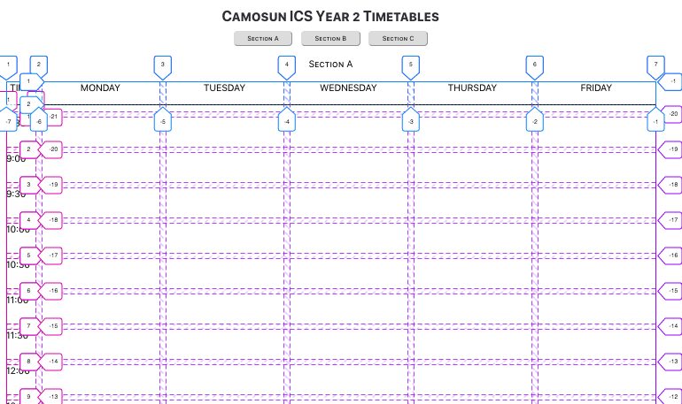
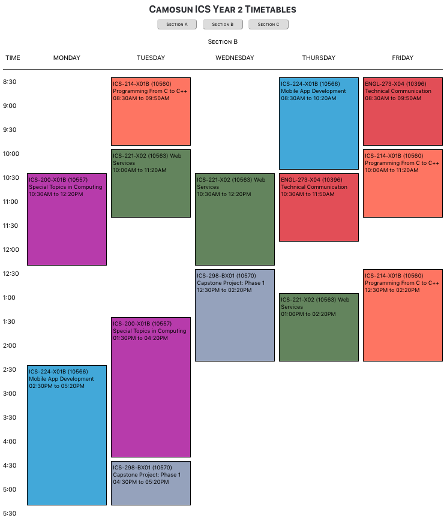

Before CSS Grid came along, the task of defining the layout for a web page to display a weekly schedule was a daunting one. Unless you were willing to throw best practices out the window and just jam everything into a big ol' table element, the floats and positioning needed to display days and times in a grid would have made for some pretty complex code. Let's look at how the CSS Grid specification can significantly reduce this pain point.

This tutorial walks through my specific use case using the React framework, but the solution could be adapted for any kind of daily, weekly or monthly scheduling application.

## The goal

In my [last post]() I explained how I scraped course information from my school's website. I then wanted to create a simple web app where I could view the three weekly schedules of the sections in my program to compare their relative merits before deciding which one I wanted to register in. I needed to be able to place the course section data on the page based on their day and time attributes, and to apply the same background colour to each course, regardless of the section. 

## Creating the back-end

For the purposes of this project, I just needed a simple and quick solution to host the data that I would be querying. Thanks to [this open source project](https://my-json-server.typicode.com/) I was able to push my JSON data to db.json files on GitHub and query the newly published "APIs" from my application.

## Defining the grids

My solution for the layout structure was to create three grids, one for the day of the week row, one for the time of day column, and one for the main class schedule grid. By making the day and time headings children of the main schedule grid, and by keeping all their sizings relative to one another, I could make them appear as though they are one grid while also giving me the flexibility to define each section differently. For instance, I was able to create a horizontal border underneath the title section. Here's the CSS for those three sections:

```css
.timetable {
  display: grid;
  grid-gap: 10px;
  grid-template-columns: 50px repeat(5, 200px);
  grid-template-rows: repeat(20, 50px);
}

.titleWrapper {
  display: grid;
  grid-column: 1 / 7;
  grid-gap: 10px;
  grid-template-columns: 50px repeat(5, 200px);
  margin-bottom: 10px;
  border-bottom: 1px solid black;
  justify-items: center;
}

.timeWrapper {
  display: grid;
  grid-row: 2 / 21;
  grid-gap: 10px;
  grid-template-rows: repeat(20, 50px);
}
```

By using the layout feature under the inspector tab in Firefox's developer toolbox, I was able to view the grid lines to see what I was working with.



## Converting the JSON data to CSS identifiers

Because the course section start times and end times in my JSON files begin with numbers, I knew that I would need to convert them to valid text-based CSS identifiers to properly place them in the grid. I also wanted to convert the day to a more readable value.

To accomplish this, I used functions inside my TableData stateless component which accepted the `props.day`, ```props.startTime``` and ```props.endTime``` variables on each render, and returned the appropriate class names. I also had a ```tableElement``` class that could be used to apply styling to all the cells at once.

```jsx
const TableData = props => {

  convertDay = weekDay => {
    if (weekDay === 'M') return("monday");
    else if (weekDay === 'Tu') return("tuesday");
    ...
  }

  convertStartTime = start_time => {
    if (start_time === "08:30AM") return("eightThirty");
    else if (start_time === "09:00AM") return("nineOclock");
    else if (start_time === "09:30AM") return("nineThirty");
    else if (start_time === "10:00AM") return("tenOclock");
    ...
  }

  convertEndTime = end_time => {
    if (end_time === "8:20AM") return("endEightThirty");
    else if (end_time === "08:50AM") return("endNineOclock");
    else if (end_time === "09:20AM") return("endNineThirty");
    else if (end_time === "09:50AM") return("endTenOclock");
    ...
  }
  ...

  return (
    <p style={tableDataMainStyle}
      className={`tableElement ${convertDay(props.day)}
      ${convertStartTime(props.startTime)} 
      ${convertEndTime(props.endTime)}`}
      ...
```

And of course, in my CSS file I needed to define what those elements meant in terms of the layout (the hover animation was something I added later for an aesthetic effect). 

```css
.tableElement {
  border: 2px solid black;
  padding: 4px;
}
.tableElement:hover {
  animation: pulse 0.3s linear 1;
  cursor: pointer;
}
.eightThirty {
  grid-row-start: 2;
}
.nineOclock {
  grid-row-start: 3; 
}
.nineThirty {
  grid-row-start: 4; 
}
...
.endNineThirty {
  grid-row-end: 4; 
}
.endTenOclock {
  grid-row-end: 5; 
}
.endTenThirty {
  grid-row-end: 6;
}
...
```

## Fetching the data and applying background colour

Inside my ```ComponentDidMount``` lifecycle method of the main stateful component (which passes props to the TableData component), I fetched the data from the server (schedule A, to start) and applied another couple of functions to generate hash codes based on the course name, and then background colours based on those hash codes. This was the best way I could think of to maintain consistency of the background colours between different sections of the same course.

```jsx
componentDidMount() {
  fetch(`https://my-json-server.typicode.com/a-bishop/timetable-server-${this.state.section}/Courses`)
  .then(response=> this.handleHTTPErrors(response))
  .then(response=> response.json())
  .then(result=> {
    console.log(result);
    this.setState({
      courses: result,
      display: {},
      colour: {}
    });
    this.state.courses.forEach((course) => {
      let hash = this.hashCode(course.Course);
      let colour = this.colourGenerator(hash);
      let courseId = course.ID;
      this.setState({
        colour: {...this.state.colour, [courseId]: colour}
      })
    });
  })
  .catch(error=> {
    console.log(error);
  });
}
```

I had trouble with certain course names generating very dark background colours, so in circumstances where an ```rgb``` value is less than 75, I bump it up by 50.

```jsx
hashCode = string => {
  if (string.length === 0) return 0;
  let chars = 0;
  for (let i = 1; i < string.length; i++) {
    let char = string.charCodeAt(i);
    chars += char;
  }
  chars = chars * string.length;
  return chars % 255;
};

colourGenerator = num => {
  let rgb = [];
  let r = (num * 13) % 255; 
  let g = (num * 9) % 255; 
  rgb.push(r);
  rgb.push(g);
  rgb.push(num);
  for (let [index, colour] of rgb.entries()) {
    if (colour < 75) {
      colour += 50;
    }
    rgb[index] = colour;
  }
  return rgb.join();
}
```

Here's where I use the ```props.colour``` variable to inject the correct rgb values into the CSS in my TableData component:

``` jsx
const tableDataMainStyle = {
  backgroundColor: `rgb(${props.colour})`,
  fontSize: '14px'
}
```

## Adding buttons for each section

Each of the section buttons at the top of the page trigger another fetch function, which again sets the colour and location of each course on the page. This time, however, I needed to use the optional callback function as the second parameter to setState, in order to ensure the asynchronous fetch occurs after the new state is applied. 

```jsx
fetchData(e) {
  this.setState({
    section: e.target.value
  }, () => {
  console.log(this.state.section);
  fetch(`https://my-json-server.typicode.com/a-bishop/timetable-server-${this.state.section}/Courses`)
  .then(response=> this.handleHTTPErrors(response))
  .then(response=> response.json())
  .then(result=> {
    console.log(result);
    this.setState({
      courses: result,
      display: {},
      colour: {}
    });
    this.state.courses.forEach((course) => {
        let hash = this.hashCode(course.Course);
        let colour = this.colourGenerator(hash);
        let courseId = course.ID;
        this.setState({
          colour: {...this.state.colour, [courseId]: colour}
        })
    });
  })
  .catch(error=> {
    console.log(error);
  });
})
}
```

Here is the component's render method, with the data fetching functions attached to each button's ```onClick``` event:

```jsx
render() {
  let section = <p className="sectionTitle">----</p>;
  if (this.state.section === "section-A") {
    section = <p className="sectionTitle">Section A</p>
  } else if (this.state.section === "section-B") {
    section = <p className="sectionTitle">Section B</p>
  } else if (this.state.section === "section-C") {
    section = <p className="sectionTitle">Section C</p>
  } 
  return (
    <div className='myCourses'>
      <Title />
        <div className='sectionSelectors'>
          <span><button onClick={this.fetchData} value="section-A">Section A</button></span>
          <span> <button onClick={this.fetchData} value="section-B">Section B</button></span>
          <span> <button onClick={this.fetchData} value="section-C">Section C</button></span>
        </div>
        {section}
        ...
```

Now that the buttons were functional, I could generate each section's schedule and quickly compare them. Here is a screenshot of the final product:



## Check out the demo

Here is a link to a [live demo](https://andrewnbishop.com/react-view-timetable/) and a link to the [full code of my project](https://github.com/a-bishop/react-view-timetable). 

I hope this blog post has been helpful and illuminating for anyone looking to set up an online schedule using React with CSS Grid! For a more in-depth treatment of CSS Grid, I definitely recommend checking out CSS-Tricks' [Complete Guide To Grid](https://css-tricks.com/snippets/css/complete-guide-grid/).